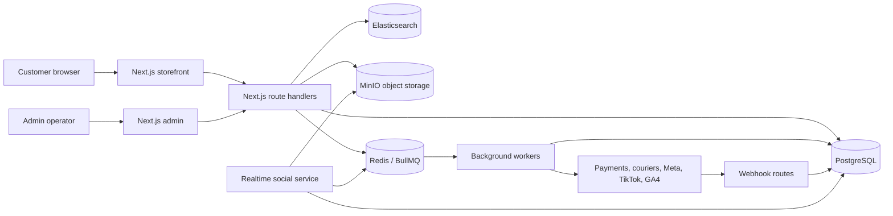
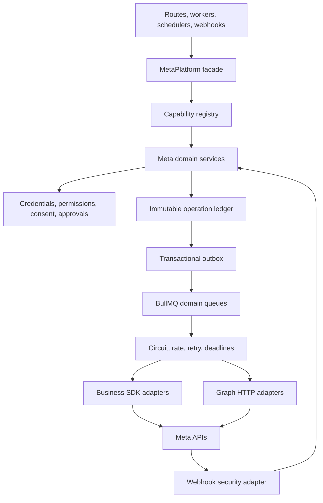
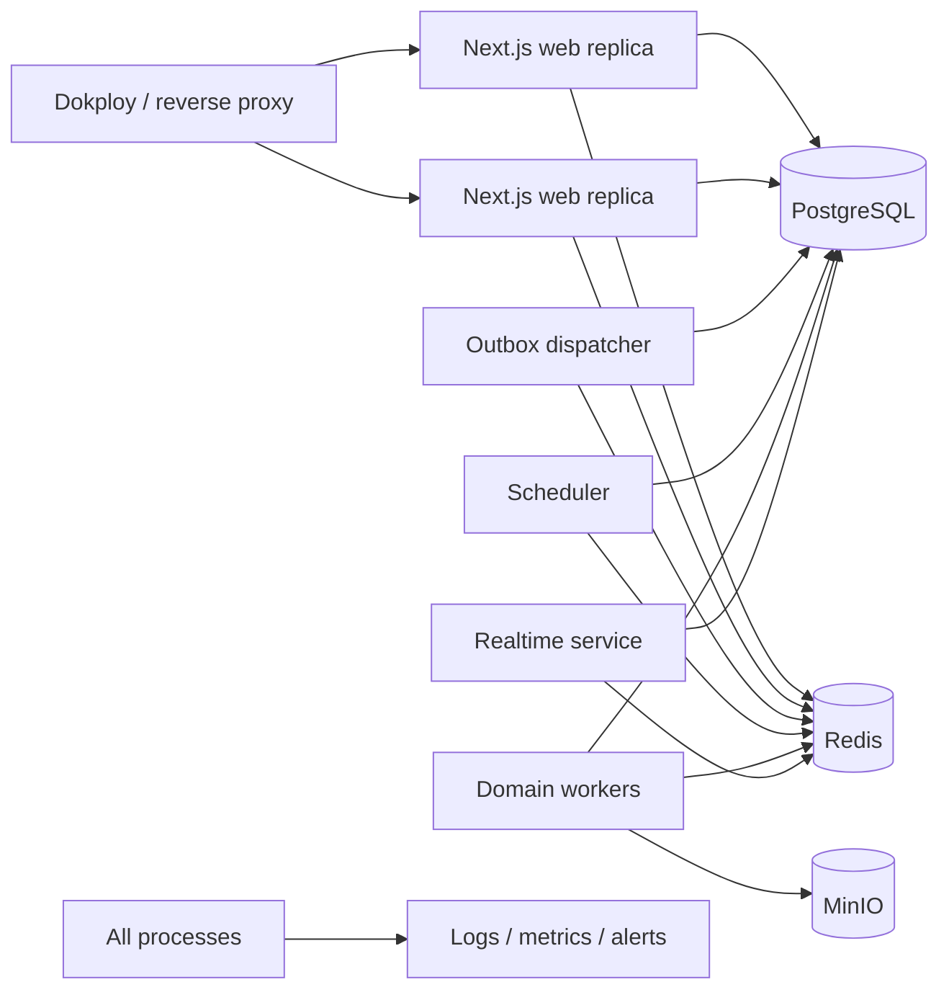

# architecture.md — Minsah Beauty System Architecture

> **Document role:** Technical source of truth for application flow, service boundaries, folder structure and technology choices.  
> **Baseline:** Uploaded repository snapshot; 431 app files, 311 library files, 119 scripts, 74 Prisma files/migrations, 24 test files and a separate realtime service.  
> **Last update:** 2026-07-24 (Phase 31 Layer 2.2 webhook envelope normalization and routing migration).

---

## 1. Architecture principles

1. **Modular monolith first:** The Next.js application and PostgreSQL database remain the main business platform. Separate processes are used for workers and realtime workloads, not arbitrary microservices.
2. **PostgreSQL is authoritative:** Orders, payments, inventory, consent, provider operations and audit state are durable in PostgreSQL.
3. **Async for external side effects:** Courier, tracking, catalog, CAPI, insights and social operations use durable jobs where appropriate.
4. **Provider isolation:** External SDK and HTTP response formats do not leak into application domains.
5. **Build-safe imports:** Importing a route/module must not connect to Redis, initialize SDK clients or require live services.
6. **At-least-once + idempotency:** Queue/webhook delivery is treated as at-least-once; handlers must be idempotent.
7. **Fail closed for security, consent and approvals.**
8. **Evidence before release:** Build and runtime evidence are architecture outputs, not optional documentation.

## 2. System context



## 3. Main user flows

### 3.1 Product discovery

```text
Browser request
→ Next.js server page / route
→ product/catalog query through Prisma or Elasticsearch
→ canonical product adapter
→ server-rendered storefront
→ optional client interactions and analytics
```

Elasticsearch is an optimization, not the system of record. Search must have a bounded fallback path.

### 3.2 Cart and checkout

```text
Product/variant selection
→ cart context/API
→ server-side product, stock and price validation
→ address and delivery validation
→ idempotency key
→ order transaction
→ payment/COD state
→ inventory reservation
→ tracking/outbox records
→ response to customer
```

External tracking or Redis failure must not roll back a valid committed order unless explicitly required by the payment transaction.

### 3.3 Online payment

```text
Create order first
→ create provider payment request
→ redirect/provider interaction
→ callback/execute/verify
→ idempotent payment state transition
→ order status update
→ stock/accounting/tracking side effects
```

Provider callbacks are untrusted input and require signature/state verification where available.

### 3.4 Courier delivery

```text
Eligible order
→ admin/system enqueue
→ Pathao or Steadfast adapter
→ provider reference stored
→ webhook/poll update
→ normalized delivery state
→ customer/admin view
```

### 3.5 Webhook processing

```text
Raw request body
→ size limit
→ signature verification
→ stable receipt/dedupe key
→ durable receipt insert
→ fast acknowledgement
→ worker processing
→ domain state transition
→ audit/metrics
```

Active application Meta webhook routes use `lib/meta-platform/transports/webhook/route-handler.ts` for declared/actual body limits, canonical challenge query extraction and exact raw-body HMAC verification. Verified requests then pass through `lib/meta-platform/transports/webhook/parser.ts`, which fail-closes malformed or oversized object/entry/change/message envelopes, binds normalization to the transport payload digest and emits versioned normalized events. `lib/meta-platform/transports/webhook/routing.ts` assigns each event deterministically to `LEAD_ADS`, `INSTAGRAM`, `FACEBOOK_PAGE` or `UNSUPPORTED`; active Lead Ads and Instagram routes now hand those normalized events to compatibility adapters instead of reading raw provider entry/change/message shapes. Durable receipt/dedupe unification remains a Layer 3 concern, and disabled legacy webhook paths remain non-processing tombstones until the realtime bridge phase.

### 3.6 Tracking events

```text
User action
→ canonical commerce event
→ consent/test-traffic policy
→ browser provider event
→ same event ID persisted for server event
→ transactional outbox
→ worker/provider request
→ delivery status and diagnostics
```

## 4. Application architecture

### 4.1 Presentation layer

- `app/(storefront)/**`: public browsing, product discovery and customer-facing informational pages.
- `app/account/**`: authenticated customer account.
- `app/admin/**`: role-protected back office and operations center.
- `components/**`: shared UI, storefront, admin, product, checkout, tracking and navigation components.
- `contexts/**`: auth, cart, categories, product and admin client state.

### 4.2 API layer

- `app/api/**/route.ts` provides route handlers.
- Route handlers perform authentication, parsing, authorization and orchestration.
- Business rules must live in `lib/**` domain/service modules, not be duplicated across routes.
- Long-running external requests must be queued or represented by provider jobs.

### 4.3 Domain and service layer

Current domains are distributed across `lib/`:

```text
lib/auth*                 authentication and authorization
lib/catalog*              catalog and storefront mapping
lib/checkout*             checkout/idempotency/order rules
lib/payments/**           payment adapters
lib/pathao*               Pathao delivery
lib/steadfast/**          Steadfast delivery
lib/search/**             search/indexing
lib/tracking/**           browser/server analytics
lib/meta/**               Meta v6 domain logic
lib/meta-business/**      current Meta SDK wrappers (legacy target)
lib/privacy/**            consent, retention and deletion
lib/jobs/**               shared Meta job infrastructure
lib/queue/**              existing queues
lib/workers/**            legacy/general workers
```

Target rule: domain modules may depend on transport interfaces; transports must not depend on routes or UI.

### 4.4 Data layer

- Prisma 7.8 with PostgreSQL adapter.
- `prisma/schema.prisma` is the canonical schema.
- `prisma/migrations/**` are forward migration history.
- Generated Prisma client is derived output and must not be manually edited.
- Transactions protect order/payment/inventory and outbox boundaries.

### 4.5 Async execution

```text
Business transaction
→ durable DB outbox/job record
→ dispatcher leases row
→ BullMQ enqueue
→ provider-specific worker
→ retry/circuit/rate policy
→ provider adapter
→ normalized result
→ DB status/event history
```

Queues must be provider/domain isolated so a catalog backlog cannot block Purchase CAPI or lead retrieval.

### 4.6 Realtime service

`realtime-service/` is an independently built Node/TypeScript service for social messaging/realtime workflows. It has its own package, Prisma config, Dockerfile and runtime validation. Root Next.js build does not prove this service is healthy.

Target integration options:

- shared internal package containing provider-independent contracts; or
- authenticated internal API to the unified platform.

It must not maintain a parallel, ungoverned Meta/Facebook client after the unified migration.

## 5. Unified Meta architecture target



### Required boundaries

```text
facebook-nodejs-business-sdk import
  → only lib/meta-platform/transports/business-sdk/**

graph.facebook.com request
  → only lib/meta-platform/transports/graph-http/**

Meta access token environment read
  → only lib/meta-platform/credentials/**

Meta webhook HMAC verification
  → only lib/meta-platform/transports/webhook/**
```

### Meta durability model

- Normal e-commerce state remains conventional relational state.
- Meta provider operations use an immutable operation/event ledger.
- Write commands use transactional outbox.
- Critical mutations store canonical provider before/after state.
- Replaying a provider command creates a new linked operation; an old event is never blindly re-executed.

### Workflow, reconciliation and replay model

```text
MetaOperation
→ versioned MetaWorkflow
→ ordered MetaWorkflowStep records
→ provider job with request fingerprint + before state
→ confirmed after state OR WAITING_RECONCILIATION
→ capability-specific resolver
→ resume remaining steps OR reverse compensation
```

- Workflow mutations use optimistic versions; PostgreSQL combines the version check and active exact fencing-token check in the same mutation predicate.
- Cross-worker ownership uses leased locks with monotonic fencing tokens; a stale holder cannot commit after takeover.
- Provider-job identity is unique per step and request fingerprint. A lost provider response is an unknown outcome, never an automatic retry; bounded reconciliation claim leases prevent concurrent resolver execution.
- Controlled replay requires a new operation, a link to the original operation, a new idempotency key bound to the full request and independent requester/approver identities. Expired unknown outcomes remain non-replayable.
- Workflow projections are rebuildable views; workflow, step, provider-job, reconciliation and replay records remain the durable evidence.

### Phase 28 connection and CAPI cutover model

```text
Connection health
→ LEGACY read
→ SHADOW legacy + MetaPlatform comparison (legacy result remains authoritative)
→ PLATFORM read
→ observed legacy disable

CAPI producer
→ PostgreSQL transactional outbox
→ dispatcher/worker
→ stable event_id cutover selector
→ exactly one of legacy or MetaPlatform Business SDK transport
→ normalized response + transport/version/credential evidence
```

- Public routes commit valid tracking events without requiring a live Meta token; credential resolution and SDK loading happen only in worker runtime.
- Connection health uses exact APP and BUSINESS_SYSTEM_USER roles, Graph token debug, normalized permission/asset checks and the central version policy.
- CAPI uses the exact CAPI credential role. Core, Purchase and offline/dataset conversions share the same cutover facade; dataset uploads provide an explicit dataset ID override without reading a token in the producer. Test-event and deterministic canary modes precede full platform writes; no shadow provider write is allowed.
- A stable event ID produces a stable canary decision across retries, preventing a retry from switching transports and duplicating a provider mutation.
- Legacy disable is a separate explicit flag after observation and rollback proof; unknown outcomes use Phase 27 reconciliation rather than blind replay.

### Phase 29 Ads, insights, targeting and audiences cutover model

```text
Campaign / AdSet / Creative / Ad / Audience read
→ LEGACY logical facade
→ SHADOW canonical comparison (legacy-shaped response remains authoritative)
→ PLATFORM read
→ bounded stale read fallback
→ observed legacy disable

Approved write
→ exact normalized payload hash
→ independent approval claim
→ provider before state
→ one selected Business SDK transport mutation
→ provider after-state verification
→ SUCCEEDED or RECONCILIATION_REQUIRED
```

- All provider access for campaigns, ad sets, ads, creatives, sync/async insights and audiences is owned by the unified Business SDK transport with exact `BUSINESS_SYSTEM_USER` authorization.
- Writes are never shadowed. Ads keep PAUSED-on-create, allowlists and budget caps; targeting is canonicalized with safe Bangladesh defaults.
- Audience direct customer data must have explicit consent and at least one strong identifier (email, phone or external ID) on every row, then is normalized plus SHA-256 hashed before the approval payload exists. The complete canonical batch is locked by an explicit digest, approval hashing is not subject to display-layer truncation, and raw PII is not part of canonical approvals or audits.
- Stale reads may support operations during provider failure, but stale insights cannot be persisted as a successful fresh sync.
- Domain/global kill switches, test-asset selection and separate legacy-disable flags preserve a reversible cutover. Unknown outcomes enter Phase 27 reconciliation instead of blind retry.

### Phase 30 catalog and commerce cutover model

```text
Canonical product/variant source
→ SKU-only identity
→ semantic mapper + sale/availability validation
→ deterministic payload hash
→ unified items-batch UPDATE
→ item-level provider outcome reconciliation
→ bounded retry for known retryable UPDATE failures

Managed stale item
→ immutable deletion dry-run plan
→ full retailer-set digest + source snapshot
→ independent CRITICAL approval
→ queued plan identity only
→ live revalidation under catalog lock
→ unified DELETE batch
→ terminal polling; no automatic DELETE retry
```

- Catalogs, items, feeds and product sets use the unified Business SDK transport; diagnostics and batch status use unified Graph HTTP with the same exact credential role and central version/deadline policy.
- Normal sync cannot delete. Invalid current canonical items remain in the desired set, preventing validation failures from becoming accidental deletions.
- Delete-plan request fields and approval binding are immutable in PostgreSQL. Count/ratio thresholds require a temporary emergency override in addition to independent approval.
- Batch results are matched by retailer ID or provider index; retry lineage is durable and only explicit retryable UPDATE failures are retried.
- Feed audit payloads retain configuration metadata but never the raw signed/tokenized URL.
- Read cutover is mode-aware with bounded stale fallback; writes remain kill-switch controlled and are never shadowed.

## 6. Deployment architecture



Deployment rules:

- Web processes do not start all background workers.
- Scheduler has one logical lease owner.
- Redis may use `redis://` on a protected private network or `rediss://` when TLS is configured; protocol must match actual infrastructure.
- PostgreSQL is backed up and supports restore/PITR drills.
- Redis queues can be reconstructed from durable database state.
- Each worker has readiness, liveness and graceful shutdown behavior.

## 7. Current folder structure

```text
.
├── app/                         Next.js App Router pages and APIs
│   ├── (storefront)/            public storefront
│   ├── account/                 customer account
│   ├── admin/                   back office and operations UI
│   └── api/                     route handlers and webhooks
├── components/                  shared React components
├── contexts/                    client-side providers/state
├── hooks/                       reusable React hooks
├── lib/                         business logic and integrations
├── workers/                     standalone worker entrypoints
├── scripts/                     QA, audits, maintenance and release gates
├── tests/                       Node and Playwright tests
├── prisma/                      schema, seed and migrations
├── config/                      machine-readable policies/manifests
├── docs/                        architecture/release/runbooks/evidence
├── public/                      static assets and PWA files
├── realtime-service/            independent realtime/social service
├── app/globals.css              runtime design tokens and global CSS
├── lib/design-tokens.ts         typed design-token values/references
├── next.config.ts               Next.js configuration
├── proxy.ts                     proxy/security/CSP behavior
└── package.json                 scripts and dependency contract
```

## 8. Target Meta platform folder structure

```text
lib/meta-platform/
├── index.ts
├── platform.ts
├── core/                        result, errors, validation, context
├── models/                      canonical provider-independent models
├── context/                     environment, tenant and asset context
├── capabilities/                operation registry and permission matrix
├── credentials/                 role selection and rotation metadata
├── versioning/                  SDK/Graph compatibility and canary
├── references/                  local ↔ provider ID mapping
├── transports/
│   ├── business-sdk/            only SDK imports
│   ├── graph-http/              only Graph HTTP calls
│   ├── webhook/                 raw-body signature and normalization
│   └── media/                   secure upload/download
├── domains/                     ads, catalog, CAPI, leads, Instagram, etc.
├── operations/                  immutable ledger and transactional outbox
├── workflows/                   versioned workflow/step/provider-job state
├── reconciliation/              unknown-outcome resolver orchestration
├── replay/                      controlled linked new-operation replay
├── projections/                 rebuildable workflow read models
├── resilience/                  circuits, retry, rate, cache, backpressure
├── concurrency/                 idempotency, locks and fencing
├── jobs/                        envelopes, dispatch and admission
├── governance/                  flags, RBAC, audit and retention
├── observability/               metrics, logs, SLO and alerts
├── migration/                   legacy facade and capability cutover
└── testing/                     provider mocks and contract fixtures
```

## 9. Technology stack

### Application

| Technology | Version / role |
|---|---|
| Node.js | 22.16.0 project engine |
| npm | 10.9.2 |
| Next.js | 16.2.12, App Router, webpack build |
| React / React DOM | 19.2.4 |
| TypeScript | 5.9.3 |
| Tailwind CSS | 4.2.2 via PostCSS |
| Headless UI | accessible UI primitives |
| Lucide React | icons |

### Data and infrastructure

| Technology | Role |
|---|---|
| PostgreSQL | durable system of record |
| Prisma / `@prisma/client` | 7.9.1 ORM and migrations |
| Redis + ioredis | cache, queue coordination, circuit counters |
| BullMQ | 5.79.2 durable worker queues |
| Elasticsearch | 9.x search and analytics index |
| MinIO | private/object media storage |
| Sharp | image processing |

### Authentication and security

| Technology | Role |
|---|---|
| NextAuth | configured social/session authentication surface |
| JOSE | token signing/verification |
| bcryptjs | password hashing |
| `server-only` | server bundle boundary |

### Provider integrations

| Integration | Role |
|---|---|
| Meta Business SDK 24.0.1 | Ads, catalog, audience and CAPI adapter source |
| Meta Graph HTTP | permissions, assets, Instagram and unsupported endpoints |
| TikTok | browser/events attribution and health |
| GA4 | analytics event pipeline |
| Pathao | delivery locations, booking and webhooks |
| Steadfast | courier booking, tracking and webhooks |
| bKash/Nagad/Rocket/card routes | payment flows |
| Telegram | order/operator notifications and action tokens |
| Google Generative AI | constrained admin assistance where configured |

### Quality and delivery

- ESLint 9 and Next.js config.
- Node test runner and TSX.
- Playwright 1.61 with axe-core.
- GitHub Actions CI/release workflows.
- Docker/Dokploy/Nixpacks deployment artifacts.

## 10. Error architecture

Application/domain error categories:

```text
VALIDATION
AUTHENTICATION
AUTHORIZATION
NOT_FOUND
CONFLICT
RATE_LIMIT
DEPENDENCY_UNAVAILABLE
TIMEOUT
CONFIGURATION
INTERNAL
RECONCILIATION_REQUIRED
```

Rules:

- Route handlers return stable safe error codes.
- Provider errors are normalized; raw tokens, URLs with secrets and PII are removed.
- Retryability is explicit, not inferred by each caller.
- Unknown provider success moves to verification/reconciliation, not blind retry.
- User messages remain actionable but do not leak internal details.

## 11. Data architecture

Major schema families include:

- users, accounts, sessions and admin users;
- products, variants, suppliers, inventory and purchase orders;
- carts, wishlists, orders, payments and returns;
- tracking, attribution, consent, deletion and health;
- Meta outbox/jobs, leads, catalog, product sets, insights, approvals, incidents and Instagram CRM;
- Facebook/realtime legacy tables pending unified migration.

Schema changes require:

1. model and index review;
2. forward migration;
3. generated-client freshness;
4. disposable apply test;
5. rollback or forward-fix rehearsal;
6. backfill verification;
7. `memory.md` update.

## 12. Architecture decision records

Architecture-changing decisions must be recorded under `docs/architecture/` as ADRs with context, decision, alternatives, consequences, migration and rollback. The minimum ADR set for the unified Meta platform is listed in `phases.md`.
